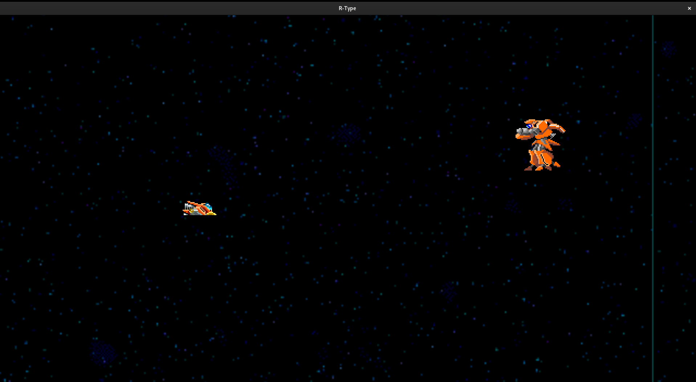

## R-Type

## Introduction

R-Type is a horizontally scrolling shooter arcade video game developed and released by Irem in 1987 and the first game in the R-Type series. The player controls a star ship, the R-9 "Arrowhead", in its efforts to destroy the Bydo, a powerful alien race bent on wiping out all of mankind. The R-9 can acquire a glowing orbicular device called a "Force", protecting it from enemy fire and providing additional firepower. The arcade version was distributed by Nintendo in North America; it is the last arcade title Nintendo distributed.

## Install

First of all, make sure you have the SFML librairy install on your computer.
If not use use this command:
```sh
sudo dnf install SFML-devel
```

And use the Makefile to Compile the project using:
```sh
make
```
or 
```sh
make re
```

## Usage
To start the project use the following command
```sh
./r_type_client
```
or
```sh
./r_type_client -h
```
If you want some help about the games

## Game
In this game, you play as a ship lost in the space and you meet some... Things.
Your goal is to survive as long as you can against some waves of monsters and bosses



## Architecture
For the architecture part, i use principally the ECS method to create my game.

# Entity Component System
Entity Component System (ECS) is a software architectural pattern mostly used in video game development for the representation of game world objects. An ECS comprises entities composed from components of data, with systems which operate on entities' components.

ECS follows the principle of composition over inheritance, meaning that every entity is defined not by a type hierarchy, but by the components that are associated with it. Systems act globally over all entities which have the required components.